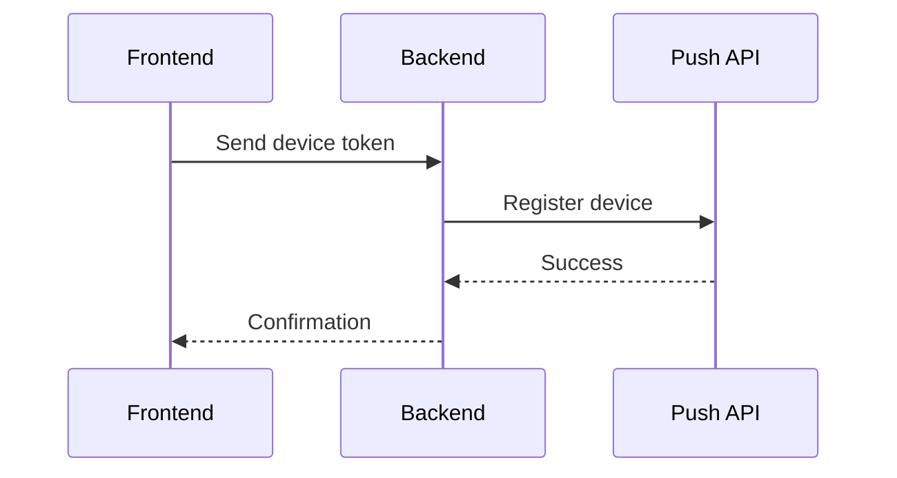

## API Authentication

Push API uses Bearer token authentication. Include your API key in the Authorization header:

```bash
Authorization: Bearer YOUR_API_KEY
```

<Note>
  Keep your API key secure and never include it in your frontend code.
</Note>

## Device Registration

The recommended way to register devices is through your backend:

1. **Frontend**: Get the device token and send it to your backend
2. **Backend**: Register the device with Push API using your API key
3. **Frontend**: Confirm registration is complete

### Example Flow



### Example Code

Frontend:
```javascript
// Get device token
const deviceToken = await getDeviceToken();
   
// Send to your backend
await fetch('https://your-backend.com/register-device', {
  method: 'POST',
  body: JSON.stringify({
    deviceToken,
    platform: 'ios'
  })
});
```

Backend:
```javascript
// Register with Push API
await pushApi.registerDevice({
  userId: 'user123',
  deviceToken: req.body.deviceToken,
  platform: req.body.platform
});
```

## Best Practices

1. **API Key Security**
   - Store your API key in your backend only
   - Use environment variables for configuration
   - Never expose the key in frontend code

2. **Device Registration**
   - Always register devices through your backend
   - Validate user authentication before registration
   - Handle registration errors gracefully

## Common Issues

<AccordionGroup>
  <Accordion title="API Key Exposure" icon="exclamation-triangle">
    Problem: API key in frontend code
    Solution: Move all API calls to your backend
  </Accordion>

  <Accordion title="Registration Failures" icon="exclamation-triangle">
    Problem: Device registration not working
    Solution: Check device token and platform values
  </Accordion>
</AccordionGroup>

## Need Help?

- [Quick Start Guide](/api-reference/quickstart)
- [API Reference](/api-reference)
- [Support](mailto:support@push.com) 