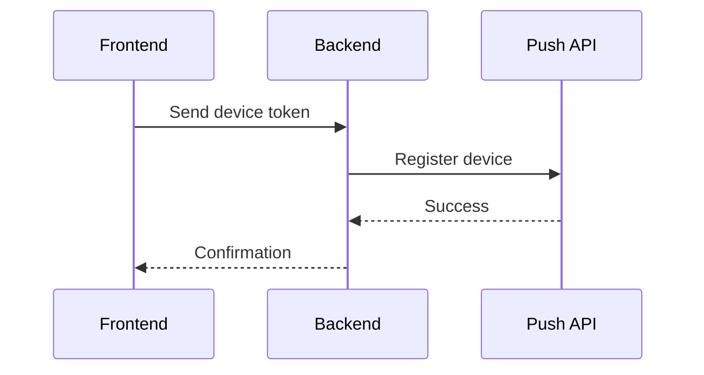

## Backend Registration

Register a device with a simple API call:

<Tabs>
  <Tab title="Node.js">
    ```javascript
    // Register a device
    await pushApi.registerDevice({
      userId: 'user123',
      deviceToken: 'device_token_here',
      platform: 'ios'
    });
    ```
  </Tab>
  <Tab title="Python">
    ```python
    # Register a device
    push_api.register_device(
      user_id='user123',
      device_token='device_token_here',
      platform='ios'
    )
    ```
  </Tab>
  <Tab title="Ruby">
    ```ruby
    # Register a device
    PushAPI.register_device(
      user_id: 'user123',
      device_token: 'device_token_here',
      platform: 'ios'
    )
    ```
  </Tab>
</Tabs>

## Getting Device Tokens

To register a device, you need to:
1. Request notification permissions
2. Get the device token
3. Send the token to your backend
4. Register with Push API

### Best Practice Flow



### Platform-Specific Implementation

<Tabs>
  <Tab title="iOS">
    ```swift
    // Request permissions
    UNUserNotificationCenter.current().requestAuthorization(options: [.alert, .sound, .badge]) { granted, error in
      if granted {
        // Get device token
        DispatchQueue.main.async {
          UIApplication.shared.registerForRemoteNotifications()
        }
      }
    }

    // Handle token
    func application(_ application: UIApplication, didRegisterForRemoteNotificationsWithDeviceToken deviceToken: Data) {
      let token = deviceToken.map { String(format: "%02.2hhx", $0) }.joined()
      
      // Send to your backend
      let url = URL(string: "https://your-backend.com/register-device")!
      var request = URLRequest(url: url)
      request.httpMethod = "POST"
      request.setValue("application/json", forHTTPHeaderField: "Content-Type")
      
      let body = [
        "deviceToken": token,
        "platform": "ios"
      ]
      
      request.httpBody = try? JSONSerialization.data(withJSONObject: body)
      
      URLSession.shared.dataTask(with: request) { data, response, error in
        if let error = error {
          print("Registration error:", error)
          return
        }
        print("Device registered successfully")
      }.resume()
    }
    ```
  </Tab>
  <Tab title="Android">
    ```kotlin
    // Get FCM token
    FirebaseMessaging.getInstance().token.addOnCompleteListener { task ->
      if (task.isSuccessful) {
        val token = task.result
        
        // Send to your backend
        val url = "https://your-backend.com/register-device"
        val body = JSONObject().apply {
          put("deviceToken", token)
          put("platform", "android")
        }
        
        val request = Request.Builder()
          .url(url)
          .post(body.toString().toRequestBody("application/json".toMediaType()))
          .build()
        
        OkHttpClient().newCall(request).enqueue(object : Callback {
          override fun onFailure(call: Call, e: IOException) {
            println("Registration error: ${e.message}")
          }
          
          override fun onResponse(call: Call, response: Response) {
            println("Device registered successfully")
          }
        })
      }
    }
    ```
  </Tab>
  <Tab title="Web">
    ```javascript
    // Request permissions and get token
    async function registerDevice() {
      try {
        // Request notification permissions
        const permission = await Notification.requestPermission();
        if (permission !== 'granted') {
          throw new Error('Notification permission denied');
        }

        // Register service worker
        const registration = await navigator.serviceWorker.register('/sw.js');
        
        // Get push subscription
        const subscription = await registration.pushManager.subscribe({
          userVisibleOnly: true,
          applicationServerKey: 'YOUR_VAPID_PUBLIC_KEY'
        });

        // Send to your backend
        const response = await fetch('https://your-backend.com/register-device', {
          method: 'POST',
          headers: {
            'Content-Type': 'application/json'
          },
          body: JSON.stringify({
            deviceToken: subscription.toJSON(),
            platform: 'web'
          })
        });
        
        if (!response.ok) {
          throw new Error('Registration failed');
        }
        
        console.log('Device registered successfully');
      } catch (error) {
        console.error('Registration error:', error);
      }
    }

    // Call when you want to register the device
    registerDevice();
    ```
  </Tab>
</Tabs>

## Best Practices

1. **Backend to Backend**
   - Always register devices through your backend
   - Never expose your Push API key in frontend code
   - Validate user authentication before registration

2. **Token Management**
   - Store tokens securely
   - Update tokens when they change
   - Handle token invalidation

3. **Error Handling**
   - Handle permission denials
   - Implement retry logic
   - Provide user feedback

## Need Help?

- [Quick Start Guide](/api-reference/quickstart)
- [Sending Messages](/api-reference/send-message)
- [API Reference](/api-reference)
- [Support](mailto:support@push.com) 